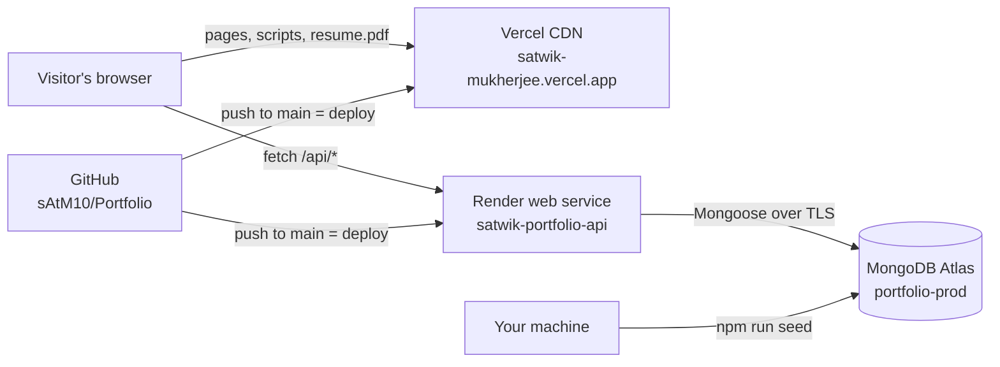

# Satwik Mukherjee — Digital Workspace: Project Handbook

What was built, why it was built that way, how it was done, and how to run, change and deploy
it from here on. The [README](../README.md) is the quick reference; this handbook is the full
story and the operating manual.

|                |                                                                                     |
| -------------- | ----------------------------------------------------------------------------------- |
| **Live site**  | <https://satwik-mukherjee.vercel.app>                                               |
| **API**        | <https://satwik-portfolio-api.onrender.com/api/health>                              |
| **Repository** | <https://github.com/sAtM10/Portfolio> (public, branch `main`)                       |
| **Hosting**    | Vercel (frontend) · Render (API) · MongoDB Atlas (database) — all free tiers        |
| **Databases**  | `portfolio` (local development) · `portfolio-prod` (production), same Atlas cluster |
| **Status**     | Phases 1–7 and 10 complete and live (launched 3 Oct 2026). Phases 8–9 deferred.     |

## Contents

1. [What we built](#1-what-we-built)
2. [Why — goals and ground rules](#2-why--goals-and-ground-rules)
3. [Architecture](#3-architecture)
4. [How it was built — phase by phase](#4-how-it-was-built--phase-by-phase)
5. [Key decisions and trade-offs](#5-key-decisions-and-trade-offs)
6. [Privacy and security model](#6-privacy-and-security-model)
7. [Running the project locally](#7-running-the-project-locally)
8. [Production: how it runs and how to operate it](#8-production-how-it-runs-and-how-to-operate-it)
9. [Making changes — recipes](#9-making-changes--recipes)
10. [Troubleshooting](#10-troubleshooting)
11. [Launch lessons learned](#11-launch-lessons-learned)
12. [Deferred work and ideas](#12-deferred-work-and-ideas)
13. [Reference](#13-reference)

---

## 1. What we built

A personal portfolio presented as an **immersive developer workspace**: instead of scrolling a
résumé, visitors explore a 3D desk — laptop, monitor, server rack, file cabinet, terminal, phone,
shelf — and each object opens a panel with part of the portfolio. Because not every visitor wants
(or can run) 3D, the same content is also available as a fast, conventional page.

Three ways in, one source of content:

| Route        | What the visitor gets                                                                                                                                                                                                                  |
| ------------ | -------------------------------------------------------------------------------------------------------------------------------------------------------------------------------------------------------------------------------------- |
| `/`          | Landing page: hero, an animated "schematic" of the workspace, a HUD bar with local time, and two doors — _Enter workspace_ or _Plain portfolio_.                                                                                       |
| `/portfolio` | Plain portfolio: About, Experience, Tech stack, Projects, Journey, Education, Interests, Contact — with a scroll-spy section nav. Recruiter- and mobile-friendly.                                                                      |
| `/workspace` | Interactive 3D desk (React Three Fiber). Click an object, its numbered marker, or the dock to open its panel. Deep links: `/workspace?object=cabinet`. Phones, no-WebGL devices and `?view=2d` get a 2D version with identical panels. |

Behind it:

- **REST API** (Express + MongoDB) serving projects and experience, accepting contact-form
  messages and anonymous analytics events.
- **Contact form** that stores messages in the database (no emails are sent).
- **Privacy-respecting analytics**: anonymous events only, no cookies, IPs or visitor IDs, and
  nothing is sent when the browser signals Global Privacy Control or Do Not Track.
- **A sanitized, downloadable résumé** (`/resume.pdf`) — no phone number.
- **Production hardening**: strict Content-Security-Policy, security headers, rate limits,
  input validation, build-time configuration checks, SEO and link-preview metadata.

## 2. Why — goals and ground rules

**Goals**

- Stand out with an interactive experience, without making recruiters work for the facts: the
  plain portfolio and 2D workspace guarantee the content is always one click away.
- Fast and accessible: code-split pages, 3D only where it can run well, keyboard and
  screen-reader support, reduced-motion support, WCAG AA contrast.
- Production quality: clean architecture, validation and security on both sides, documented
  deployment, reproducible builds.

**Ground rules set at the start (they still apply to every change)**

- **No phone number anywhere** — site, source, metadata, JSON, API responses, downloadable files.
  Public contact details are limited to the email `satwik.mukherjee7000@gmail.com` and the
  location _Navi Mumbai, Maharashtra_.
- **No confidential company information** — no internal URLs, credentials, proprietary
  architecture, customer data, screenshots or sensitive business logic; professional projects
  describe role, technologies and general contribution only. (The résumé PDF was approved for
  publishing as-is by the owner.)
- **Never invent content or URLs.** Project links are optional; when a URL is missing the button
  is simply not rendered.
- **Secrets never enter Git.** Only `.env.example` files are committed; real values live in
  `server/.env` (local), Render and Vercel.
- **Minimal visitor data.** No stored IP addresses, visitor IDs, cookies or fingerprints.

## 3. Architecture



Two independent apps in one repository:

```
portfolio/
├── client/            React app → deployed to Vercel (root directory: client)
│   ├── public/        favicon, icons, og-image.png, resume.pdf (served as-is)
│   ├── src/
│   │   ├── data/      ALL portfolio text and settings (edit content here)
│   │   ├── pages/     LandingPage, PortfolioPage, WorkspacePage, NotFoundPage
│   │   ├── sections/  landing/, portfolio/, content/ (shared panels), workspace/ (UI around 3D)
│   │   ├── three/     3D scene: WorkspaceScene, CameraRig, layout.js, objects/*
│   │   ├── components/ ui/, layout/, motion/, forms/, icons/
│   │   ├── hooks/     useApiContent, usePortfolioContent, useActiveSection, useTrackEvent, useMediaQuery
│   │   ├── services/  api.js (fetch wrapper, warm-up), analytics.js (beacons)
│   │   └── styles/    index.css — Tailwind theme tokens
│   ├── vercel.json    rewrites, caching, security headers (CSP)
│   └── vite.config.js build checks, SEO files, résumé guard
├── server/            Express API → deployed to Render (root directory: server)
│   ├── src/           config/, models/, validators/, middleware/, services/, controllers/, routes/
│   └── scripts/seed.js  copies projects + experience from client/src/data into MongoDB
├── render.yaml        Render Blueprint
└── docs/              this handbook
```

### Frontend

- **Stack:** React 19, Vite 8, React Router 8, Tailwind CSS 4, Motion (Framer Motion), Three.js
  with React Three Fiber and drei, lucide icons, self-hosted fonts (Instrument Sans, JetBrains Mono).
- **Routing and loading:** the landing page is in the main bundle; `/portfolio`, `/workspace` and
  404 are lazy chunks; the 3D scene is a further lazy chunk that is only downloaded when 3D is
  actually shown (never on phones).
- **One content source:** every text lives in `client/src/data/`. The landing schematic, the plain
  portfolio and the workspace panels all render from it, and the panels reuse the same components
  as the portfolio sections (`src/sections/content`), laid out with container queries.
- **Content data flow:** projects and experience render instantly from the bundled copy, then are
  replaced by the API response (`useApiContent`, cached per browser session). If the API is slow,
  asleep or down, visitors still see complete content. Each section exposes
  `data-source="api"` or `"fallback"` for debugging.
- **3D scene:** built from primitives only (no model or HDR downloads). Renders on demand
  (frames only while something moves), pixel ratio capped at 1.5, shadows and environment
  rendered once. The camera eases to the selected object and shifts the projection so the object
  stays centred beside the side panel. Object markers are DOM elements projected from 3D
  positions (accessible, crisp text).
- **Motion:** route changes use the browser's View Transitions API; landing and portfolio
  animations are CSS-only; Motion is used only inside the workspace chunk. Reduced-motion users
  get instant camera moves and no decorative animation.

### Backend

- **Stack:** Node.js 24, Express 5, Mongoose 9, Zod 4, Helmet, CORS, express-rate-limit, morgan
  (development only). Uses Node's built-in `--env-file-if-exists` and `--watch` — no dotenv or nodemon.
- **Layers:** routes → validation middleware (Zod) → controllers (thin) → services (data access)
  → models (Mongoose).
- **Responses** are always `{ "data": … }` or `{ "error": { "message", "details"? } }`; internal
  fields (`_id`, `__v`, `published`, timestamps) are never exposed.

| Method | Path                                         | Purpose                             | Rate limit   |
| ------ | -------------------------------------------- | ----------------------------------- | ------------ |
| GET    | `/api/health`                                | Status, database state, environment | —            |
| GET    | `/api/projects` (`?category=`, `?featured=`) | Published projects, sorted          | 300 / 15 min |
| GET    | `/api/projects/:id`                          | One project by slug or ObjectId     | 300 / 15 min |
| GET    | `/api/experience`, `/api/experience/:id`     | Experience entries                  | 300 / 15 min |
| POST   | `/api/contact`                               | Store a contact message             | 5 / 15 min   |
| POST   | `/api/events`                                | Store an anonymous analytics event  | 60 / min     |

**Collections** (database `portfolio-prod` in production):

| Collection        | Contents                                                                                                       | Written by        |
| ----------------- | -------------------------------------------------------------------------------------------------------------- | ----------------- |
| `projects`        | Project cards (slug, title, category, description, highlights, technologies, optional links, order, published) | `npm run seed`    |
| `experiences`     | Jobs (slug, company, role, dates, highlights, technologies, order, published)                                  | `npm run seed`    |
| `contactmessages` | name, email, subject, message, status (`new` / `read` / `archived`), timestamps — nothing else                 | Contact form      |
| `siteevents`      | eventType, small metadata, path, timestamp — deleted automatically after 365 days                              | Analytics beacons |

## 4. How it was built — phase by phase

The project followed a 10-phase plan; each phase ended with checks and a commit.

| Phase                | What                                                                                                                                              | Why / how                                                                                                              | Commit                                     |
| -------------------- | ------------------------------------------------------------------------------------------------------------------------------------------------- | ---------------------------------------------------------------------------------------------------------------------- | ------------------------------------------ |
| 1. Setup             | Repo layout (independent `client/` + `server/`), ESLint 10 flat config, Prettier, EditorConfig, root convenience scripts; Node upgraded to 24 LTS | Two deployable apps that share nothing at runtime; consistent formatting from day one                                  | `9994b8f`                                  |
| 2. Base design       | Design tokens (semantic colours only, WCAG AA on every surface), typography, landing page with hero, workspace schematic and HUD                  | A distinctive "warm desk lamp + monitor glow" identity, defined once in `styles/index.css`                             | `5b2ca6d`                                  |
| 3. Plain portfolio   | All eight sections, content in `src/data`, a phone-free résumé copy, privacy rules applied to project descriptions                                | The recruiter path first: everything readable without 3D; personal-project copy limited to confirmed facts (`9353c38`) | `37166b8`, `9353c38`                       |
| 4. API               | Models, Zod validation, error envelopes, rate limits, origin checks, idempotent seed script                                                       | Content and messages served/stored safely; the client data files stay the single source of truth                       | `2b9cc36`                                  |
| 5. Frontend ↔ API    | `useApiContent` with bundled fallback, contact form with inline server errors, analytics beacons                                                  | The site never breaks when the API is asleep; beacons use `text/plain` to avoid CORS preflights                        | `6772c49`                                  |
| 6. 3D workspace      | React Three Fiber desk, camera rig, projected markers, object dock, deep links, 2D fallback                                                       | Immersive but robust: same panels in 3D and 2D, 3D code only loaded when used                                          | `bae90a3`                                  |
| 7. Animations        | View Transitions, CSS reveal-on-scroll, Motion confined to the workspace chunk, reduced-motion and print support                                  | Moving Motion out of the portfolio cut that chunk from ~52 KB to ~11 KB gzipped                                        | `a7541d0`                                  |
| 8. Mobile fallback   | **Deferred** — the essentials already exist (responsive layouts, 2D workspace)                                                                    | —                                                                                                                      | —                                          |
| 9. Performance + SEO | **Deferred** — SEO essentials were done in Phase 10                                                                                               | —                                                                                                                      | —                                          |
| 10. Production       | Vercel + Render configs, security headers, SEO/link previews, build guards, résumé publishing, deployment, live verification                      | See below                                                                                                              | `69b56f3`, `1e94968`, `8f6e2cf`, `adacd0e` |

**Phase 10 in detail**

- `client/vercel.json`: SPA rewrites (deep links work on refresh), one-year caching for hashed
  assets, and security headers — CSP, `nosniff`, referrer policy, permissions policy, COOP.
- `render.yaml`: Render Blueprint for the API (Node 24, health check, `npm ci --omit=dev`).
- `MONGODB_DB_NAME`: lets the same cluster credentials target `portfolio-prod`.
- SEO: canonical link, Open Graph/Twitter tags with a 1200×630 preview image, JSON-LD `Person`
  (email and location only), and `robots.txt` + `sitemap.xml` generated at build time.
- Build-time guards in `vite.config.js` (see [section 6](#6-privacy-and-security-model)).
- Free-tier cold starts handled: warm-up ping on first page load, 30-second contact timeout,
  content always available from the bundle.
- Sanitized résumé published with cleaned PDF metadata.
- Deployed: GitHub → Render (API) and Vercel (site); domain `satwik-mukherjee.vercel.app`;
  production verified end to end, including a real contact message.

## 5. Key decisions and trade-offs

| Decision                                                | Why                                                    | Trade-off                                                              |
| ------------------------------------------------------- | ------------------------------------------------------ | ---------------------------------------------------------------------- |
| Content lives in `client/src/data`, seeded into MongoDB | One place to edit; the site works even without the API | Projects/experience changes need a re-seed of production (see recipes) |
| Bundled fallback, then API swap                         | Instant render, resilient to Render's cold starts      | Two copies of projects/experience must be kept in sync by seeding      |
| 3D lazy-loaded, 2D on phones and without WebGL          | Performance and battery on mobile; works everywhere    | 3D chunk is ~1 MB (272 KB gzipped) on desktop — candidate for Phase 9  |
| Primitives instead of 3D models                         | No asset downloads, small and fast, fully controllable | Stylised rather than photorealistic look                               |
| Motion only in the workspace                            | Keeps portfolio and landing light                      | CSS animations for the rest of the site                                |
| Vercel + Render + Atlas free tiers                      | Zero cost, Git-based deploys                           | API sleeps after ~15 min idle; first request can take ~50 s            |
| Separate `portfolio-prod` database                      | Test data never reaches production                     | Seed production explicitly                                             |
| No email notifications                                  | Simplicity, no mail credentials to manage              | Check messages in Atlas periodically                                   |
| Strict CSP with exact API origin                        | Blocks injected scripts and data exfiltration          | API URL changes must also update `vercel.json`                         |
| Build guards that fail the deploy                       | Misconfiguration can never go live silently            | A wrong variable shows up as a failed deploy (by design)               |

## 6. Privacy and security model

**Data protection**

- Phone number appears nowhere; verified on the live site (all pages, every script including lazy
  chunks, API responses, the résumé).
- Contact messages store only what the visitor typed plus status and timestamps.
- Analytics: anonymous events only, `sessionStorage` flag to avoid counting reloads, respects GPC
  and Do Not Track, auto-deleted after 365 days.
- Rate limiting uses IPs in memory only; they are never stored.

**API hardening:** Helmet headers, CORS allow-list (`CLIENT_URL`), an extra origin check on POST
routes (403 for other sites), 20 KB body limit (2 KB for beacons), Zod validation, Mongoose
`sanitizeFilter` + `strictQuery`, contact-form honeypot, 503 while the database is unreachable.

**Site hardening (`client/vercel.json`):**

```
default-src 'self'; script-src 'self'; style-src 'self' 'unsafe-inline'; img-src 'self' data:;
font-src 'self'; connect-src 'self' https://satwik-portfolio-api.onrender.com;
frame-ancestors 'none'; base-uri 'self'; form-action 'self'; object-src 'none'; upgrade-insecure-requests
```

**Build guards (`client/vite.config.js`)** — a production build fails when:

- `VITE_SITE_URL` is missing, invalid or not `https` (localhost allowed only on your machine);
- `VITE_API_URL` is not defined, or — on Vercel — points to localhost or is not `https`;
- `VITE_RESUME_URL` is set but is not a site path like `/resume.pdf` or an `https` URL.

It also removes `resume.pdf` from the build unless `VITE_RESUME_URL` is set, and never inlines
fonts (the CSP only allows font files from the site itself).

**Secrets:** `server/.env` (local, git-ignored) and Render hold `MONGODB_URI`. Vercel holds only
public `VITE_*` values. The Git history was scanned before publishing and contains no
credentials.

## 7. Running the project locally

### Prerequisites

- **Node.js 24** (minimum 22.12) — check with `node -v`. npm 10+. Git.
- Access to the MongoDB Atlas project (for the API). The site itself runs without it.

### First-time setup

```bash
git clone https://github.com/sAtM10/Portfolio.git
cd Portfolio
npm run install:all
```

Create the env files from the examples (PowerShell shown; on macOS/Linux use `cp`):

```powershell
Copy-Item client/.env.example client/.env
Copy-Item server/.env.example server/.env
```

Then edit **`server/.env`**: set `MONGODB_URI` to the Atlas connection string for the
**`portfolio`** (development) database. Never commit this file, never paste it into chat.

Optionally, in **`client/.env`**, set `VITE_RESUME_URL=/resume.pdf` to show the résumé buttons.

Load content into the development database:

```bash
cd server
npm run seed
```

### Daily development

Two terminals from the repository root:

```bash
npm run dev:server
```

```bash
npm run dev:client
```

- Site: <http://localhost:5173> (hot reload)
- API: <http://localhost:5000/api/health>

### Check a production build locally

```bash
npm run build
npm run preview --prefix client
```

Then open <http://localhost:4173>. Notes:

- The build uses `client/.env`; localhost values are accepted on your machine.
- For the preview to talk to your local API, `server/.env` must allow its origin:
  `CLIENT_URL=http://localhost:5173,http://localhost:4173` (restart the server after editing).
- `vite preview` does not apply `vercel.json` headers, so CSP problems only show on Vercel.
- If you pass `VITE_*` values on the command line in **Git Bash**, prefix with
  `MSYS_NO_PATHCONV=1` — otherwise Git Bash rewrites `/resume.pdf` into a Windows path. PowerShell
  and `.env` files are not affected.

### Quality checks (run before every push)

```bash
npm run lint
npm run format:check
npm run build
```

`npm run format` fixes formatting automatically.

## 8. Production: how it runs and how to operate it

### Where everything lives

| Piece    | Where                                                           | Settings that matter                                                            |
| -------- | --------------------------------------------------------------- | ------------------------------------------------------------------------------- |
| Site     | Vercel project `portfolio` (team "Satwik Mukherjee's projects") | Root Directory `client`; domain `satwik-mukherjee.vercel.app` (Production)      |
| API      | Render web service `satwik-portfolio-api` (Blueprint-managed)   | Root `server`; health check `/api/health`                                       |
| Database | MongoDB Atlas cluster, database `portfolio-prod`                | Network Access `0.0.0.0/0` (Render free tier has no fixed IP) + strong password |
| Code     | GitHub `sAtM10/Portfolio`, branch `main`                        | —                                                                               |

### Environment variables in production

**Vercel → Settings → Environment Variables** (type **Config**, Production and Preview):

| Variable          | Value                                       |
| ----------------- | ------------------------------------------- |
| `VITE_API_URL`    | `https://satwik-portfolio-api.onrender.com` |
| `VITE_SITE_URL`   | `https://satwik-mukherjee.vercel.app`       |
| `VITE_RESUME_URL` | `/resume.pdf`                               |

**Render → satwik-portfolio-api → Environment:**

| Variable          | Value                                                                                           |
| ----------------- | ----------------------------------------------------------------------------------------------- |
| `CLIENT_URL`      | `https://satwik-mukherjee.vercel.app` (comma-separate to allow more origins; no trailing slash) |
| `MONGODB_URI`     | Atlas connection string (secret)                                                                |
| `MONGODB_DB_NAME` | `portfolio-prod`                                                                                |
| `NODE_ENV`        | `production`                                                                                    |
| `NODE_VERSION`    | `24`                                                                                            |
| `TRUST_PROXY`     | `1`                                                                                             |

`VITE_*` values are **baked in at build time**: after changing one on Vercel, redeploy. On
Render, edit the variables and click **Save, rebuild, and deploy** so the API restarts with them.

### How deploys happen

Every push to `main` automatically deploys **both** the site (Vercel) and the API (Render).
Nothing is deployed from your machine — except **database content**, which you seed manually
(see [recipes](#9-making-changes--recipes)). If a Vercel build fails (for example a build guard
rejects a variable), the previous deployment keeps serving; the failure reason is at the end of
the build log.

### Day-to-day operations

- **Health:** <https://satwik-portfolio-api.onrender.com/api/health> should report
  `"environment":"production"` and `"database":"connected"`.
- **Contact messages:** Atlas → Browse Collections → `portfolio-prod` → `contactmessages`. Nobody
  is notified — check periodically. Change `status` to `read` or `archived` by editing the
  document. The launch test message ("Launch checklist test") can be deleted.
- **Analytics:** Atlas → `portfolio-prod` → `siteevents`, filter e.g. `{ "eventType": "portfolio_visit" }`.
  Event types: `portfolio_visit`, `plain_mode_open`, `workspace_enter`, `resume_open`,
  `project_open`, `contact_submit`.
- **Logs:** Render → service → Logs (API); Vercel → Deployments → a deployment → Logs (builds).
- **Cold starts:** the free Render instance sleeps after ~15 minutes without traffic; the first
  request can take about 50 seconds. The site stays usable meanwhile (bundled content, warm-up
  ping, 30-second contact timeout).
- **Old address:** `portfolio-one-virid-14d2t22cmh.vercel.app` still serves the site but is not in
  `CLIENT_URL`, so its contact form fails. Share only `satwik-mukherjee.vercel.app` (optionally
  set the old domain to redirect in Vercel → Domains → Edit). Hashed deployment URLs are private
  (Vercel login) by design.

## 9. Making changes — recipes

> **Release routine for any change:** edit → run locally → `npm run lint` → `npm run format:check`
> → `npm run build` → commit → `git push` → both sites redeploy → spot-check the live site.

### Edit text, skills, journey, education, interests, profile

Edit the file in `client/src/data/` (`profile.js`, `skills.js`, `journey.js`, `education.js`,
`interests.js`, `portfolioSections.js`, `workspaceObjects.js`, `navigation.js`), then release.
These are bundled with the site — no database step.

### Edit or add projects and experience (two steps!)

These are served from the database, so **pushing alone is not enough**:

1. Edit `client/src/data/projects.js` or `experience.js` and release (updates the bundled copy).
2. Seed **production** from your machine:

   ```powershell
   cd server
   $env:MONGODB_DB_NAME='portfolio-prod'; npm run seed; Remove-Item Env:MONGODB_DB_NAME
   ```

   (Git Bash / macOS / Linux: `MONGODB_DB_NAME=portfolio-prod npm run seed`.) Also run plain
   `npm run seed` to update your development database.

Seeding inserts new entries, updates changed ones and leaves the rest untouched. It **never
deletes**: to remove a project from the live site, delete its document in Atlas
(`portfolio-prod.projects`) or set `published: false` there, and remove it from `projects.js`.

Project fields: `id` (slug, lowercase-with-dashes, unique), `title`, `category`
(`professional`/`personal`), `period`, `role`, `description`, `highlights` (max 8),
`technologies` (max 20), `githubUrl`/`liveUrl` (https or `null` — buttons hide when `null`),
`featured`, `order`. Keep to confirmed facts; never add placeholder URLs.

### Update the résumé

1. Replace `client/public/resume.pdf`.
2. Check it: no phone number, no confidential details, and clean metadata (title/author/subject/
   keywords — your PDF viewer's Document Properties). Anything pushed stays in the public Git
   history forever.
3. Release. To hide the résumé entirely, delete `VITE_RESUME_URL` on Vercel and redeploy.

### Change the look

Colours, fonts and spacing tokens are in `client/src/styles/index.css` (`@theme`). Only semantic
colours exist (`canvas`, `surface`, `fg`, `accent`, …); keep text at WCAG AA contrast. Reusable
building blocks are in `client/src/components/ui`.

### Change the 3D workspace

Object positions, marker anchors and camera poses: `client/src/three/layout.js`. Object models:
`client/src/three/objects/*`. Which object opens which panel: `client/src/data/workspaceObjects.js`.
Test at desktop width, on a phone width (2D), and with `?view=2d`.

### Add an API endpoint

Follow the existing pattern in `server/src`: Zod schema in `validators/` → service in `services/`
→ controller in `controllers/` → route in `routes/` (register in `routes/index.js`) with a rate
limiter. Return `{ data }` or throw `HttpError`. If the browser must call a new origin, update the
CSP `connect-src` in `client/vercel.json`.

### Change the domain

1. Vercel → Domains → **Add Existing** → new name, connected to **Production**.
2. Vercel → Environment Variables → `VITE_SITE_URL` → new URL → **Redeploy**.
3. Render → Environment → `CLIENT_URL` → new URL (keep the old one comma-separated during the
   switch if needed) → **Save, rebuild, and deploy**.

### Move the API to another host or URL

Update **all three**: Vercel `VITE_API_URL`, the CSP `connect-src` in `client/vercel.json`
(commit + push), and the new host's `CLIENT_URL`. Otherwise the browser blocks every API call.

### Rotate the database password

Atlas → Database Access → Edit user → Edit Password. Then update `MONGODB_URI` in `server/.env`
and in Render → Environment (Render redeploys). Do this immediately if the password is ever
shared or exposed.

### Upgrade dependencies

In `client/` and `server/`: `npm outdated`, then `npm update` (minor/patch) or install specific
majors deliberately; run the full quality checks and test all three routes and the 3D scene
before pushing. Commit `package-lock.json` changes.

### Work on a bigger change safely

Create a branch and push it: Vercel builds a **preview deployment** (behind Vercel login). Its API
calls are rejected by CORS unless you temporarily add the preview origin to `CLIENT_URL`, so
content there comes from the bundled copy. Merge to `main` to release.

## 10. Troubleshooting

| Symptom                                                                               | Cause                                                                    | Fix                                                                                               |
| ------------------------------------------------------------------------------------- | ------------------------------------------------------------------------ | ------------------------------------------------------------------------------------------------- |
| Vercel build fails: `Invalid production build configuration`                          | A `VITE_*` variable is missing, invalid or points to localhost           | Fix it in Vercel (type Config) → Redeploy; the log lists each problem                             |
| Vercel won't save an edited `VITE_*` variable ("Remove the public framework prefix…") | Variable was created as **Secret**; secrets can't be changed to Config   | Delete it and re-create it as **Config**                                                          |
| Live site: projects show `data-source="fallback"`, contact form fails                 | API asleep (wait ~1 min) or CORS: site origin not in Render `CLIENT_URL` | Check `/api/health`; check `CLIENT_URL` exists and matches exactly                                |
| Console: `Refused to connect … violates connect-src`                                  | API URL not allowed by the CSP                                           | Update `connect-src` in `client/vercel.json`                                                      |
| Link previews show localhost or wrong URL                                             | Built with wrong `VITE_SITE_URL`                                         | Fix variable → Redeploy                                                                           |
| `DEPLOYMENT_NOT_FOUND` on a `*.vercel.app` address                                    | Domain not attached to the project                                       | Vercel → Domains → Add, connect to Production                                                     |
| Hashed `*.vercel.app` URL asks for a Vercel login                                     | Deployment Protection (by design)                                        | Use the production domain                                                                         |
| `npm run seed` / API: `Authentication failed`                                         | Wrong password or unencoded special characters in `MONGODB_URI`          | Fix `server/.env` (URL-encode `@ : / ? # %`)                                                      |
| API: `Could not reach the cluster`                                                    | IP not allowed in Atlas Network Access                                   | Add your IP (Render uses `0.0.0.0/0`)                                                             |
| `git push` rejected: authentication failed                                            | Stale saved GitHub password                                              | Windows Credential Manager → remove `git:https://github.com` → push again and sign in via browser |
| Port 5173/5000 already in use                                                         | Another dev server running                                               | Stop it, or change ports (`vite.config.js` / `PORT` + `VITE_API_URL`)                             |
| `429 Too many …`                                                                      | Rate limit hit                                                           | Wait for the window to reset                                                                      |

## 11. Launch lessons learned

Real issues found during deployment, and what now prevents them:

1. **Fonts blocked by the CSP** — Vite inlined small font files as `data:` URIs, which
   `font-src 'self'` rejects. → Fonts are never inlined (`assetsInlineLimit`).
2. **GitHub repo created with a README** — a plain push would be rejected. → Merged the remote
   commit instead of force-pushing.
3. **Stale GitHub credentials** in Windows Credential Manager. → Push once from a terminal and
   sign in through the browser.
4. **Git Bash path conversion** turned `/resume.pdf` into `C:/Program Files/Git/resume.pdf`. →
   Build guard rejects such values.
5. **`.env.example` values pasted into Vercel** shipped localhost URLs (broken API, wrong link
   previews). → Build guard fails any Vercel build that points to localhost.
6. **Vercel "Secret" variables with a `VITE_` prefix can't be edited.** → Create `VITE_*`
   variables as **Config**.
7. **Render `CLIENT_URL` was never created**, so the API only accepted localhost. → After any
   Render setup, confirm each variable actually exists.
8. **`portfolio-one-virid.vercel.app`** (without the suffix) belongs to someone else — never point
   anything at it.

## 12. Deferred work and ideas

- **Phase 8 — Mobile:** simplified 3D for tablets; testing on real phones and tablets.
- **Phase 9 — Performance and SEO:** Lighthouse pass; shrink the 3D chunk (~1 MB / 272 KB gzipped);
  image and structured-data refinements; consider pinning Node `24.x` in `package.json` engines
  (Vercel warns that `>=22.12.0` auto-upgrades on new majors).
- **Content:** fuller descriptions, tech stacks and links for the personal projects
  (PetPuja, Custom Google Maps, Connect-4, Iris Control) once provided — PetPuja has its own
  Vercel project that could be linked.
- **Possible later features:** an authenticated admin page for messages (`published` and `status`
  fields are already in place), email notifications, a custom domain.

## 13. Reference

### Scripts (repository root)

| Script                            | What it does                                 |
| --------------------------------- | -------------------------------------------- |
| `npm run install:all`             | Install client and server dependencies       |
| `npm run dev:client`              | Vite dev server with hot reload (port 5173)  |
| `npm run dev:server`              | API with auto-restart (port 5000)            |
| `npm run build`                   | Production build of the site → `client/dist` |
| `npm run lint`                    | ESLint, both apps                            |
| `npm run format` / `format:check` | Prettier, both apps                          |

In `server/`: `npm start` (production start), `npm run seed` (sync projects and experience).
In `client/`: `npm run preview` (serve the built site on port 4173).

### Local environment variables

**`server/.env`**: `NODE_ENV` (`development`), `PORT` (`5000`), `CLIENT_URL`
(`http://localhost:5173`), `MONGODB_URI` (Atlas string, database `portfolio`), `TRUST_PROXY`
(empty), `MONGODB_DB_NAME` (empty; `portfolio-prod` only when seeding production).

**`client/.env`**: `VITE_API_URL` (`http://localhost:5000`), `VITE_SITE_URL`
(`http://localhost:5173`), `VITE_RESUME_URL` (empty or `/resume.pdf`).

### Build output (production)

| File                                       | Size   | Gzipped |
| ------------------------------------------ | ------ | ------- |
| Main bundle (`index-*.js`)                 | 336 KB | 107 KB  |
| Styles (`index-*.css`)                     | 47 KB  | 9.5 KB  |
| Portfolio content chunk                    | 32 KB  | 11 KB   |
| Workspace page chunk                       | 95 KB  | 33 KB   |
| 3D scene chunk (desktop `/workspace` only) | 1.0 MB | 272 KB  |

### Commit history

| Commit    | Date       | Summary                                                        |
| --------- | ---------- | -------------------------------------------------------------- |
| `9994b8f` | 2026-10-02 | Initial project setup                                          |
| `5b2ca6d` | 2026-10-02 | Base portfolio UI                                              |
| `37166b8` | 2026-10-02 | Portfolio content                                              |
| `9353c38` | 2026-10-02 | Phase 3 cleanup: keep personal project copy to confirmed facts |
| `2b9cc36` | 2026-10-02 | Express API with MongoDB integration                           |
| `6772c49` | 2026-10-02 | Connect frontend to API                                        |
| `bae90a3` | 2026-10-02 | Interactive workspace                                          |
| `a7541d0` | 2026-10-03 | Animations and transitions                                     |
| `69b56f3` | 2026-10-03 | Production preparation                                         |
| `1e94968` | 2026-10-03 | Merge GitHub initial commit                                    |
| `8f6e2cf` | 2026-10-03 | Publish sanitized resume and lock CSP to the Render API        |
| `adacd0e` | 2026-10-03 | Reject localhost URLs in hosted production builds              |
